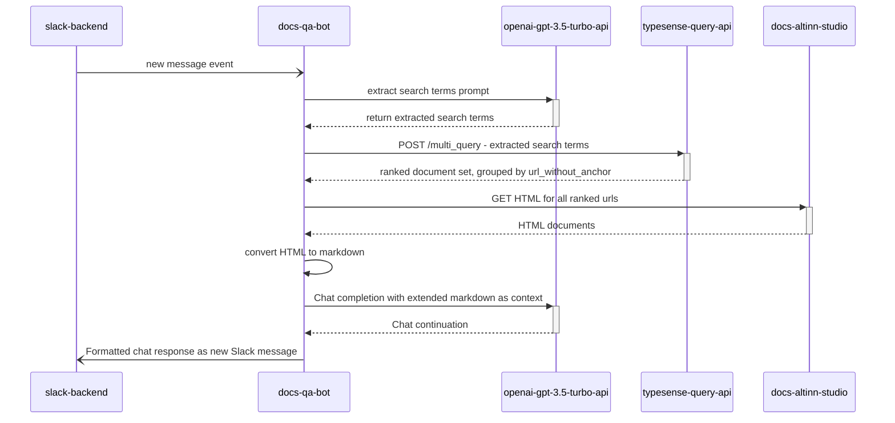

# Digdir Slack bot 

This is an early version of a general purpose Generative AI Assistant, hosted as a Slack app. 

The goal is to rapidly prototype core GenAI concepts to support Altinn 3 app developers by better leveragine the rich data sources already available. 

The main data sources on the evaluation list include:

- Altinn 3 Studio documentation, schema files and source code
- Publicly available Altinn 3 app source code
- Slack conversation history related to developer support

## Quickstart

### Install dependencies:  

`poetry install`

### Run `docs_qa` bot: 

`poetry run python main.py docs "<your question>"`

### Start Slack bot

To start the Slack bot endpoint, launch the terminal from the project directory and run the following command:

`poetry run python bolt.py`

Note: in order for your local bot endpoint to receive traffic from Slack, you need to configure a proxy service such as `ngrok`, and configure a Slack app to use the URL allocated by ngrok.
 

# How it works

## RAG concepts

TODO: 

_add description and background references here_

_add sequence diagram for RAG with query understanding here_

## Local development

### Producing derived data sets from code repositories

### code_qa

produce list of filenames to generate summaries for:
find /Users/<path_to_repos>/altinn/apps/ValidateData -type f | grep "ValidationHandler.cs$" > needs-summary-update.txt

from project root folder:

poetry run python3 code_qa/update_summaries.py <path_to>/needs-summary-update.txt ./code_qa/prompts/altinn3-csharp-code-summarize.txt

## Indexing Altinn Studio Docs

docs_qa is dependent on the DocSearch web scraper for updating the Typesense free text index.

1. Checkout repo
2. Setup .env file with following properties
3. Run scraper to update search index

## Tools
- **LangChain**: Framework for developing applications powered by language models
- **C Transformers**: Python bindings for the Transformer models implemented in C/C++ using GGML library
- **FAISS**: Open-source library for efficient similarity search and clustering of dense vectors.
- **Sentence-Transformers (all-MiniLM-L6-v2)**: Open-source pre-trained transformer model for embedding text to a 384-dimensional dense vector space for tasks like clustering or semantic search.
- **Llama-2-7B-Chat**: Open-source fine-tuned Llama 2 model designed for chat dialogue. Leverages publicly available instruction datasets and over 1 million human annotations. 
- **Poetry**: Tool for dependency management and Python packaging

